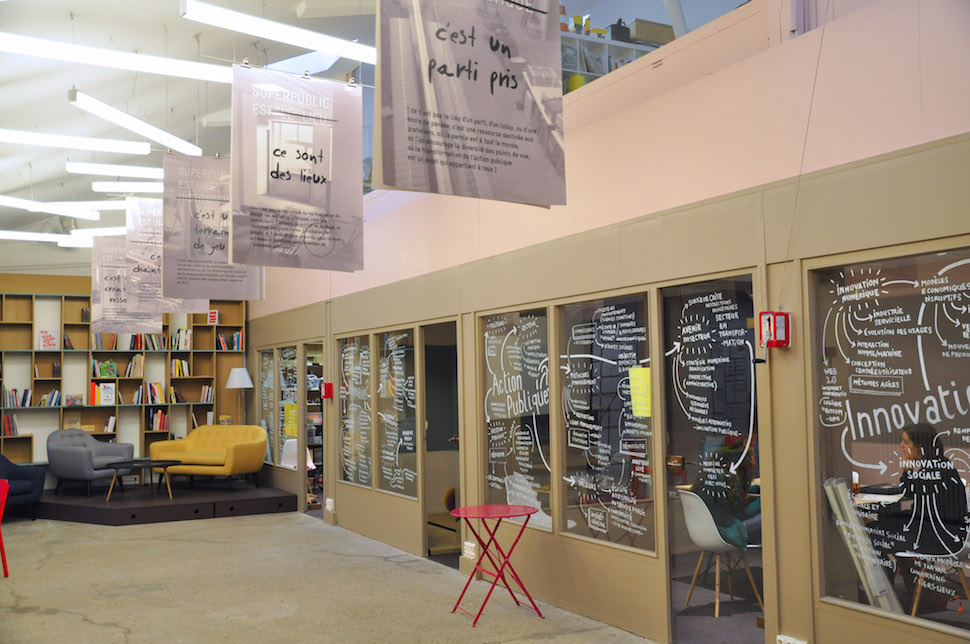
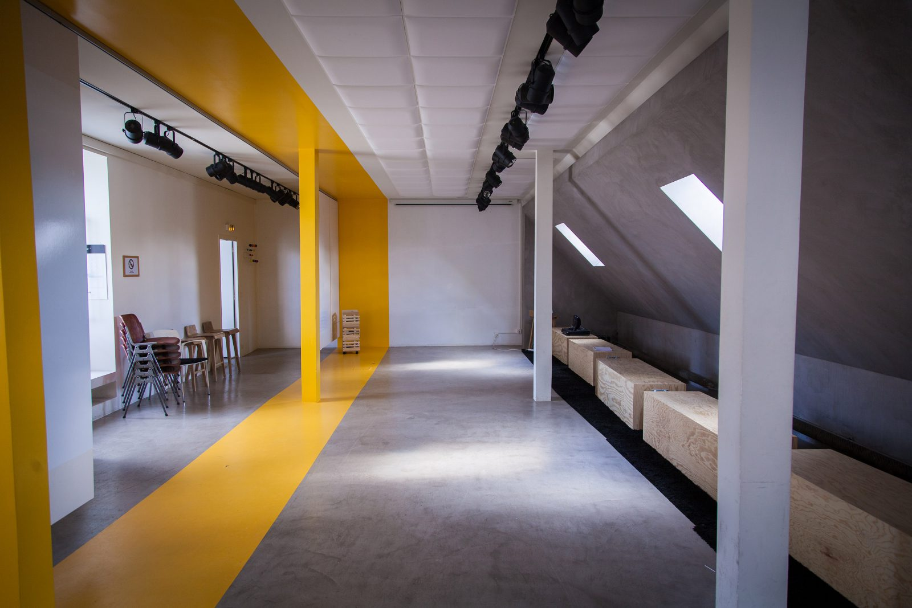
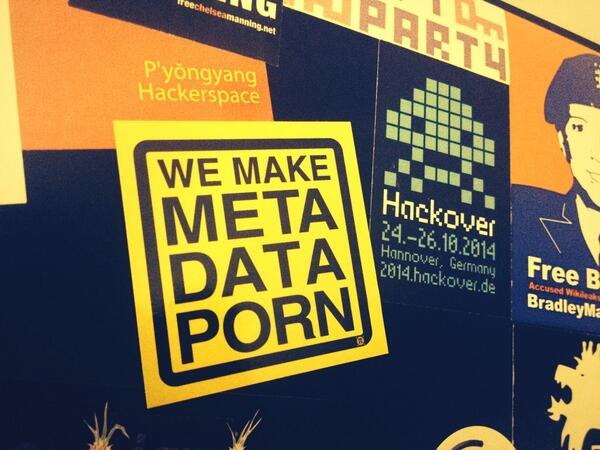
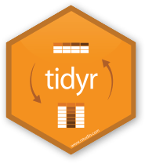
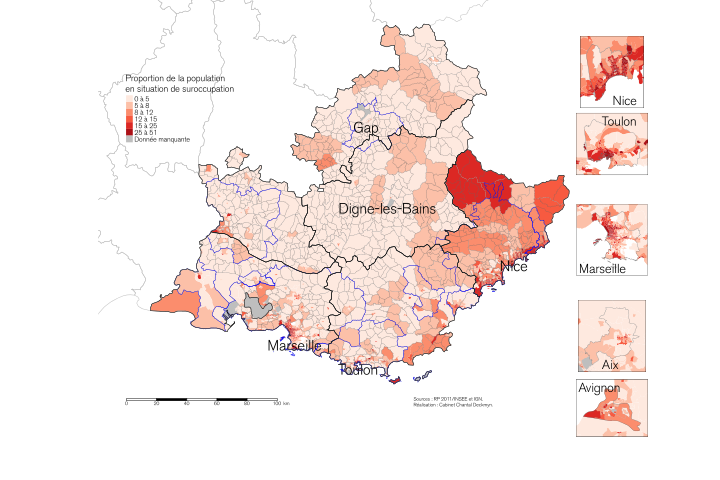
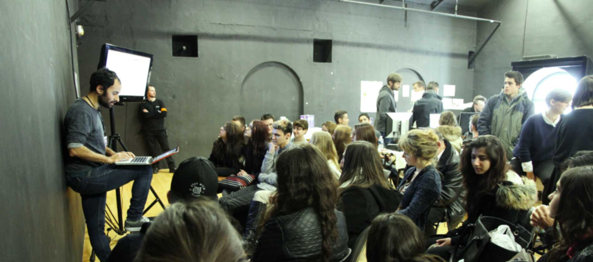

<style media="screen" type="text/css">
footer {
  font-size: 70%;
}
</style>

<script>
  (function(i,s,o,g,r,a,m){i['GoogleAnalyticsObject']=r;i[r]=i[r]||function(){
  (i[r].q=i[r].q||[]).push(arguments)},i[r].l=1*new Date();a=s.createElement(o),
  m=s.getElementsByTagName(o)[0];a.async=1;a.src=g;m.parentNode.insertBefore(a,m)
  })(window,document,'script','https://www.google-analytics.com/analytics.js','ga');

  ga('create', 'UA-80486908-1', 'auto');
  ga('send', 'pageview');

</script>

```{r setup, include=FALSE}
knitr::opts_chunk$set(echo = FALSE)
```

## Objectifs de la formation

Cette formation s'adresse notamment aux chefs de projet Open Data des collectivités et services de l'État. Son objectif principal est de leur permettre d'acquérir une bonne connaissance de [R](https://www.r-project.org/) et de son écosystème, dans la mesure où R s'est imposé comme la *lingua franca* de l'analyse de données. S'il ne s'agit pas de former des *data scientists*, cette formation ambitionne de donner un aperçu des possibilités offertes par R ainsi que de rendre les participants autonomes pour un certain nombre de tâches courantes aisées et de difficulté intermédiaire.

## Moyens pédagogiques

Cette formation aura une orientation pratique assumée : après une phase théorique courte, chaque participant manipulera, sur sa propre machine, des données et du code. À cet effet, des supports seront fournis aux participants (fichiers Rmarkdown/markdown/HTML), comprenant en particulier des scripts R commentés et documentés, qui peuvent par la suite être adaptés pour accomplir des tâches similaires ou proches. De plus, une documentation collaborative sera constituée au cours de la formation (voir infra).

## Déroulé

La formation se déroule en deux sessions indépendantes, qui peuvent donc être suivies indépendamment l’une de l’autre. Cependant, la deuxième session suppose de maîtriser les notions acquises au cours de la première session. 

La première session aura lieu dans les locaux de [Superpublic](http://www.superpublic.fr) (Paris 11e), la seconde session dans les locaux du [Tank](http://letank.fr) (Paris 11e, sous réserve). 

```{r, out.width="50%"}
;
```

## Plan de la formation

### Module 1 – Introduction aux outils d’analyse de données et à R

*17 au 19 octobre 2016*

**Lundi 17 octobre 2016 – Introduction générale**

10h30-17h30


10h-10h30 : accueil des participants

- Pourquoi s'intéresser à l'analyse de données 
- Données, données… quelles données ? 
- Présentation de l'écosystème de l'analyse de données : quelques outils

```{r, out.width="50%", fig.align='center'}

```


**Mardi 18 octobre 2016 – Prise en main de R et de son écosystème**

9h30-17h30


- Présentation de R et de son écosystème
- Panorama d'utilisations possibles de R
- Scripter, documenter, répliquer
- Installation et prise en main de R et [Rstudio](http://www.rstudio.com) (environnement de développement pour R)
- Collecte de données sur les participants et traitement en direct

```{r, out.width="50%", fig.align='center'}
knitr::include_graphics("./img/rstudio-hexbin-sticker-from-rstudio.png")
```


**Mercredi 19 octobre 2016 – Acquérir, nettoyer, gérer, publier ses données**

9h30-16h30

- Import de données
- Notion de « tidy data »
- Boîte à outils : dplyr et tidyr
- Recodage de données 	
- Agrégation de données
- Publier et diffuser des données

```{r, out.width="50%", fig.align='center'}

```


### Module 2 – Utiliser R pour l’analyse et la visualisation de données

*14-16 novembre 2016*

**Lundi 14 novembre 2016 – Éléments de visualisation de données**

10h30-17h30

- Principes de dataviz (Tufte, Wilkinson, Few...)
- Systèmes graphiques dans R
- ggplot2 et la grammaire des graphiques
- Aller plus loin avec ggplot2 (petits multiples, visualisation de modèles, composition de dataviz complexes…)

```{r, out.width="50%", fig.align='center'}
knitr::include_graphics("./img/rstudio-hex-ggplot2-dot-psd.png")
```


**Mardi 15 novembre 2016 – Modélisation, prédiction, machine learning… **

9h30-17h30

- Qu'est-ce que modéliser ? Pourquoi modéliser ?
- Modélisation, machine learning, big data
- Construire et analyser un modèle linéaire dans R 
- Construire et analyser un modèle logistique dans R 

```{r, out.width="50%", fig.align='center'}
knitr::include_graphics("./img/rstudio-hex-broom.png")
```


**Mercredi 16 novembre 2016 – Cartographie**

9h30-16h30

- Présentation des capacités cartographiques de R
- Principes de cartographie
- Introduction au package (plugin supplémentaire pour R) “tmap”
- R et OpenStreetMap

```{r, out.width="50%", fig.align='center'}

```


## Prix, inscription

L'inscription à chaque module coûte 950 € HT (1140 € TTC) par participant (792 € HT/950 € TTC pour les collectivités membres d'Open Data France -- pour des stagiaires non agents publics, nous contacter). Le suivi de chaque module donne lieu à la délivrance d’une attestation. L’inscription se fait auprès d’OpenData France ; les adhérents d'ODF sont prioritaires  mais des stagiaires appartenant à des collectivités non adhérentes d'OpenData France sont admis. 

Inscription à l'adresse : [formation@opendatafrance.email](mailto:formation@opendatafrance.email)

La formation pourra accueillir 16 personnes maximum, date limite d’inscription : 10 octobre.

[Télécharger la présentation en pdf](https://datactivist.github.io/assets/formation.pdf)

## Notre approche

L'approche proposée par datactivi.st repose sur trois principes :

- *Rendre accessible la science des données à des non-spécialistes* : il ne s'agit pas de former des data scientists, mais bien de donner à des acteurs les moyens de s’approprier des outils pour accomplir de manière autonome des tâches simples ou intermédiaires, mais aussi pour comprendre les enjeux de la science des données telle qu'elle se pratique, et ainsi être en mesure de discuter en connaissance de cause avec des professionnels sur une base éclairée, dans le cadre d'une commande, d'une collaboration, etc. Il s'agit aussi de désacraliser une discipline aujourd'hui parée de vertus quasi-miraculeuses, en expliquant clairement le potentiel et les limites, ainsi que les enjeux.

- *Former dans une démarche d'empowerment* : notre objectif est de donner du pouvoir d'agir aux acteurs (publics, privés ou associatifs) avec lesquels nous travaillons. Plutôt que de fournir des prestations clés en main, nous sommes particulièrement attentifs à donner autant d'autonomie que possible aux acteurs que nous formons. Nous souhaitons aussi  favoriser la mixité dans un domaine qui demeure encore trop masculin.

- *Documenter de manière libre et participative* : Participative, parce qu'elle est coproduite par nos formateurs et les participants à la formation, au moyen d'un pad partagé – c'est le gage d'une appropriation optimale par les participants. Les notes seront reprises pour produire une documentation complète de la formation accompagnée d'illustrations pédagogiques et d'animations GIF qui permettent une prise en main rapide des méthodes et des outils. Libre, parce que nous croyons aux vertus de l'open et pratiquons ce que nous prêchons – tous nos supports de formation sont placés sous licence libre. Aussi proposons-nous que les supports produits à l'occasion de cette formation soient placés en licence CC-BY-SA (avec mention d'une coréalisation datactivi.st / Opendata France) et publiés sur nos sites respectifs.

```{r, out.width="100%", fig.align='center'}

```


##Qui sommes-nous ?


[*datactivi.st*](http://datactivi.st) est un collectif d'un nouveau type, qui se donne pour mission de mettre l'open data au service de la société civile et des citoyens. Par du conseil, de la formation et des actions de médiation, nous accompagnons les collectivités publiques, les collectifs citoyens et les entreprises vers cet objectif.


Samuel Goëta est sociologue. Sa thèse entre dans [les coulisses de l'open data](http://www.coulisses-opendata.com/) et interroge les conditions de mise en œuvre de ces projets. Spécialiste des questions numériques, il a été précédemment consultant à la Netscouade. Il est co-fondateur de [l'association Open Knowledge France](http://fr.okfn.org/) où il milite pour que l'ouverture du savoir bénéficie à tous. 
Email : [sam@datactivi.st](mailto:sam@datactivi.st)


Joël Gombin est politiste et data scientist. Dans son [travail de sociologie électorale](https://cv.archives-ouvertes.fr/joel-gombin), il utilise de manière régulière l’open data. Il s’intéresse également activement aux enjeux des données ouvertes crowdsourcées. Il est un usager enthousiaste, un formateur et un [développeur R](https://github.com/joelgombin). 
Email : [joel@datactivi.st](mailto:joel@datactivi.st)


Samuel et Joël enseignent notamment [les enjeux de l'open data pour la recherche urbaine à Sciences Po](http://formation.sciences-po.fr/enseignement/2015/OGLM/2050).


Quelques références : Celsa Paris Sorbonne, Conférence universitaire de Suisse occidentale, OCDE, Sciences Po, Slate.fr, Spiil,  Université de Picardie-Jules Verne, Web Foundation.


```{r, out.width="50%", fig.align='center'}

```

```{r, out.width="50%", fig.align='center'}

```


<footer>
Crédits : [logo R](https://www.r-project.org/logo/) : the R foundation (CC-BY-SA 4.0) ; [salle Superpublic](http://superpublic.fr/wp-content/uploads/sites/4/2015/03/photo-superpublic-site1.jpg) : Superpublic ; [salle le Tank](http://letank.fr/wp-content/uploads/2015/08/reservoir-1600x1067.jpg) : le Tank ; [we make meta data porn](https://twitter.com/JanGuth/status/419095030390091776) : Jan Guth ; [stickers](https://www.stickermule.com/user/1070448958/stickers) : RStudio ; carte : cabinet Chantal Deckmyn ; [photo Samuel](https://www.flickr.com/photos/sylviafredriksson/25967093895/in/album-72157666078906651/) : Sylvia Fredriksson.

Cette page est sous licence CC-BY-SA 4.0.

[Mentions légales](./mentionslegales.html)

</footer>